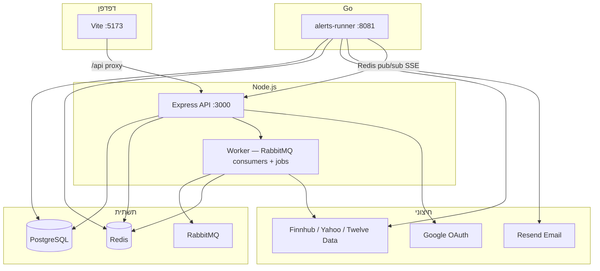

# Trading Signal

פלטפורמת מסחר אישית לניהול watchlist, חדשות שוק, רעיונות השקעה (Market Ideas), והתראות מחיר — עם ממשק React מודרני ו-API מבוסס Express.

---

## תוכן עניינים

1. [סקירה כללית](#סקירה-כללית)
2. [מבנה המונורפו](#מבנה-המונורפו)
3. [ארכיטקטורה](#ארכיטקטורה)
4. [מחסנית טכנולוגית](#מחסנית-טכנולוגית)
5. [התחלה מהירה](#התחלה-מהירה)
6. [משתני סביבה](#משתני-סביבה)
7. [מסד נתונים](#מסד-נתונים)
8. [API](#api)
9. [ממשק משתמש (Client)](#ממשק-משתמש-client)
10. [החלטות ארכיטקטוניות](#החלטות-ארכיטקטוניות)
11. [פיתוח יומיומי](#פיתוח-יומיומי)
12. [בדיקות ו-CI](#בדיקות-ו-ci)
13. [פריסה (Production)](#פריסה-production)
14. [כללי קוד ו-Cursor](#כללי-קוד-ו-cursor)

---

## סקירה כללית

**Trading Signal** מאפשר למשתמש רשום:

| יכולת | תיאור |
|--------|--------|
| **Market News** | חדשות שוק מגוונות (Finnhub + ingest) |
| **Market Ideas** | המלצות מבוססות P/E וסקטור, עם פילטרים ב-URL |
| **Watchlist** | רשימות מותאמות אישית, חיפוש מניה, גרף מחיר |
| **Price Alerts** | עד 3 התראות מחיר פעילות, אימייל, היסטוריה, SSE בזמן אמת |
| **Landing** | דף נחיתה ציבורי עם חדשות ללא התחברות |

**אימות:** אימייל/סיסמה + Google OAuth (JWT ב-cookie httpOnly).

---

## מבנה המונורפו

```
trading-signal/
├── client/                 # React + Vite + Tailwind
├── server/                 # Express API + Prisma + Worker
├── alerts-runner/          # Go — בדיקת התראות מחיר + אימייל
├── packages/
│   └── contracts/          # טיפוסים משותפים (client + server)
├── docker-compose.dev.yml  # סביבת פיתוח מלאה
├── docker-compose.prod.yml   # בניית production
└── .cursor/rules/          # כללי Cursor לפי תחום
```

**npm workspaces:** `client`, `server`, `packages/*`

```bash
npm install          # מהשורש — בונה גם את contracts (postinstall)
npm run build        # contracts → server → client
npm run test         # contracts + server
```

---

## ארכיטקטורה

### תרשים שירותים (Docker Dev)



### הפרדת אחריות

| שכבה | אחריות |
|------|--------|
| **client** | UI, React Query, routing, עיצוב |
| **server (HTTP)** | Routes → Controllers → Services → Repositories |
| **server (worker)** | Ingest חדשות, המלצות, צרכני RabbitMQ — **לא** בדיקת alerts |
| **alerts-runner** | Cron בדיקת מחיר, trigger, אימייל, פרסום SSE |
| **packages/contracts** | מודלים משותפים, `HTTP_STATUS`, parsers |

### זרימת התראת מחיר

1. משתמש יוצר `PriceAlert` (baseline + אחוז סף).
2. **alerts-runner** (כל 5 דק' בשעות מסחר US) שואב מחיר מ-Redis/Finnhub.
3. אם חריגה → רשומה ב-`AlertNotification`, alert מושבת (`enabled: false`).
4. אופציונלי: אימייל דרך Resend.
5. Redis pub/sub → Server SSE → Toast + badge בניווט ב-client.

---

## מחסנית טכנולוגית

### Client

| כלי | שימוש |
|-----|--------|
| React 19 | UI |
| Vite 8 | Build + dev server |
| TypeScript 6 | טיפוסים |
| Tailwind CSS 4 | עיצוב + design tokens |
| TanStack React Query | מצב שרת, cache, mutations |
| React Router 7 | ניווט |
| Axios | HTTP (עם `withCredentials`) |
| lightweight-charts | גרף מניה |
| Radix UI | Dialog, Select, Dropdown |
| Lucide | אייקונים |

### Server

| כלי | שימוש |
|-----|--------|
| Express 4 | HTTP API |
| Prisma 6 | ORM + migrations |
| PostgreSQL 16 | DB עיקרי |
| Redis (ioredis) | Cache מחירים, חדשות, המלצות, leaderboard |
| RabbitMQ | תורי `stock_ticks`, `market_news` |
| axios | קריאות לספקי market data |
| bcrypt + JWT | אימות |
| Vitest + Supertest | בדיקות |

### Alerts Runner

| כלי | שימוש |
|-----|--------|
| Go 1.22 | שירות התראות |
| PostgreSQL | אותו DB כמו השרת |
| Redis | מחירים + pub/sub ל-SSE |

### Contracts

חבילת `@trading-signal/contracts` — טיפוסי TypeScript משותפים:

- `alert`, `auth`, `recommendation`
- `httpStatus` — קודי HTTP אחידים
- `parseAlertNotification` — ולידציה ל-SSE

---

## התחלה מהירה

### דרישות

- Docker + Docker Compose
- מפתח **Finnhub** (חינמי) — [finnhub.io](https://finnhub.io)
- אופציונלי: Google OAuth, Resend (אימייל התראות)

### שלבים

```bash
# 1. שכפול והתקנה
git clone <repo-url> trading-signal
cd trading-signal
npm install

# 2. הגדרת סביבה
cp server/.env.example server/.env
# ערוך server/.env — לפחות FINNHUB_API_KEY

# 3. הרמת כל השירותים
docker compose -f docker-compose.dev.yml up -d --build
```

### כתובות (פיתוח)

| שירות | URL |
|--------|-----|
| Client | http://localhost:5173 |
| API | http://localhost:3000/api |
| RabbitMQ Management | http://localhost:15672 (guest/guest) |
| alerts-runner (dev trigger) | http://localhost:8081 |

### פיתוח מקומי ללא Docker (חלקי)

```bash
# טרמינל 1 — תשתית בלבד
docker compose -f docker-compose.dev.yml up postgres redis rabbitmq -d

# טרמינל 2 — שרת
cd server && npm run dev

# טרמינל 3 — worker
cd server && npm run dev:worker

# טרמינל 4 — client
cd client && npm run dev

# טרמינל 5 — alerts-runner (נדרש Go)
cd alerts-runner && go run .
```

---

## משתני סביבה

קובץ מלא: `server/.env.example`

### חובה לפיתוח

| משתנה | תיאור |
|--------|--------|
| `DATABASE_URL` | PostgreSQL |
| `REDIS_URL` | Redis |
| `JWT_SECRET` | חתימת JWT |
| `FINNHUB_API_KEY` | נתוני שוק (כש-`MARKET_DATA_PROVIDER=finnhub`) |
| `CLIENT_URL` | מקור ה-client (אימיילים, CORS) |

### אימות

| משתנה | תיאור |
|--------|--------|
| `GOOGLE_CLIENT_ID` / `SECRET` | OAuth |
| `GOOGLE_CALLBACK_URL` | בדרך כלל `http://localhost:5173/api/auth/google/callback` |
| `AUTH_ALLOW_MOCK` | `true` רק לפיתוח — משתמש מזויף |

### Market Data

| משתנה | ברירת מחדל | תיאור |
|--------|------------|--------|
| `MARKET_DATA_PROVIDER` | `finnhub` | `finnhub` \| `twelveData` |
| `MARKET_DATA_HISTORY_PROVIDER` | yahoo (עם Finnhub חינמי) | גרפים |
| `STOCK_CACHE_TTL_SECONDS` | 300 | TTL מחיר ב-Redis |
| `STOCK_HISTORY_CACHE_TTL_SECONDS` | 3600 | TTL היסטוריה |

### חדשות והמלצות

| משתנה | תיאור |
|--------|--------|
| `NEWS_INGEST_*` | Worker שואב חדשות לתור |
| `RECOMMENDATIONS_*` | Worker מחשב Market Ideas |
| `DASHBOARD_NEWS_CACHE_TTL_SECONDS` | TTL Redis לחדשות |
| `DASHBOARD_RECOMMENDATIONS_CACHE_TTL_SECONDS` | TTL Redis להמלצות |

### התראות

| משתנה | תיאור |
|--------|--------|
| `RESEND_API_KEY` / `EMAIL_FROM` | אימייל התראות |
| `ALERTS_RUNNER_URL` | `http://localhost:8081` — כפתור "Run check" בפיתוח |
| `ALERT_CHECK_INTERVAL_MS` | מרווח בדיקה (Go) |

### Production

ב-`NODE_ENV=production` השרת מריץ `validateProductionEnv` — דורש JWT חזק, אוסר mock auth, בודק `DATABASE_URL`, מפתחות ספק, ועוד.

---

## מסד נתונים

Prisma: `server/prisma/schema.prisma`

| מודל | תפקיד |
|------|--------|
| `User` | משתמש (אימייל, hash, googleId) |
| `Signal` | תוצאת חיפוש/טיק — snapshot מחיר + המלצה |
| `Watchlist` / `WatchlistItem` | רשימות מותאמות + קישור ל-Signal |
| `PriceAlert` | התראת מחיר (symbol, threshold, baseline) |
| `AlertNotification` | אירוע trigger + `readAt` |

מיגרציות:

```bash
cd server
npm run db:migrate:dev    # פיתוח
npm run db:migrate        # production (deploy)
```

---

## API

בסיס: `/api`

### Auth (`/api/auth`)

| Method | Path | תיאור |
|--------|------|--------|
| POST | `/signup`, `/login`, `/logout` | אימייל/סיסמה |
| GET | `/me` | משתמש נוכחי (דורש cookie) |
| GET | `/google`, `/google/callback` | OAuth |

### Dashboard

| Method | Path | Auth | תיאור |
|--------|------|------|--------|
| GET | `/dashboard/news` | אופציונלי | חדשות (ציבורי / מותאם watchlist) |
| GET | `/dashboard/recommendations` | לא | Market Ideas (`?sector=&source=`) |

### Stocks (`/api/stock`, `/api/stocks`)

| Method | Path | תיאור |
|--------|------|--------|
| GET | `/stock/:symbol` | Quote (דורש auth) |
| GET | `/stock/:symbol/history?range=` | OHLCV לגרף |
| GET | `/stocks/:symbol/search` | חיפוש + שמירת Signal |
| GET | `/health` | בריאות שירות |

### Watchlists

| Method | Path | תיאור |
|--------|------|--------|
| GET/POST | `/watchlists` | רשימות |
| POST | `/watchlists/:id/stocks` | הוספת מניה |
| DELETE | `/watchlists/:id/stocks/:signalId` | הסרה |

### Alerts

| Method | Path | תיאור |
|--------|------|--------|
| CRUD | `/alerts` | עד 3 alerts פעילים למשתמש |
| GET | `/alerts/notifications` | היסטוריה |
| PATCH | `/alerts/notifications/:id/read` | סימון כנקרא |
| GET | `/alerts/stream` | SSE |
| POST | `/alerts/run-check` | טריגר ידני (פיתוח) |

שגיאות דומיין ממופות דרך `lib/*HttpErrors.ts`; קודי סטטוס מ-`@trading-signal/contracts/httpStatus`.

---

## ממשק משתמש (Client)

### נתיבים

| Path | תיאור |
|------|--------|
| `/` | Landing — חדשות ציבוריות |
| `/login` | התחברות (split screen) |
| `/dashboard` | Market News |
| `/dashboard/recommendations` | Market Ideas + `?sector&source&action&sort` |
| `/dashboard/alerts` | התראות |
| `/watchlist`, `/watchlist/:symbol` | Watchlist + גרף |

### מבנה תיקיות (features)

```
client/src/
├── api/              # Axios + queryKeys
├── components/       # UI משותף (Button, Panel, StockLogo, …)
├── features/
│   ├── alerts/       # התראות
│   ├── auth/         # התחברות
│   ├── dashboard/    # טאבים, חדשות, המלצות
│   ├── landing/
│   ├── stocks/       # hooks לquote/history/search
│   ├── theme/        # Dark mode
│   └── watchlists/
├── lib/              # helpers טהורים
├── routes/           # AppRoutes, ProtectedRoute
└── types/            # re-export מ-contracts
```

### ניהול מצב

- **React Query** — כל fetch/mutation; מפתחות ב-`api/queryKeys.ts`
- **URL** — פילטרים ב-Market Ideas (`useRecommendationFilters`)
- **SSE** — `useAlertStream` + invalidation של notifications

### עיצוב

- Design tokens: `client/src/styles/tokens.css` (navy / green fintech)
- Dark mode: `ThemeProvider` + `localStorage`
- רכיבים: Tailwind + shadcn-style ב-`components/ui/`

---

## החלטות ארכיטקטוניות

### 1. מונורפו + Contracts

טיפוסים משותפים ב-`packages/contracts` מונעים drift בין client ל-server (alerts, HTTP status, המלצות).

### 2. Worker נפרד מ-HTTP

`server.ts` — API בלבד.  
`worker.ts` — RabbitMQ, ingest חדשות, רענון המלצות.  
**בדיקת התראות לא ב-Node** — רק ב-**alerts-runner** (Go), ליציבות ולתזמון.

### 3. שכבות בשרת

```
routes → controllers → services → repositories
```

- אין Prisma ב-controllers
- Parsing ב-`lib/parse*.ts`
- שגיאות דומיין ב-`lib/*Error.ts` + `*HttpErrors.ts`
- Middleware אימות: `server/src/middleware/auth.ts`

### 4. Cache Redis

- מחירים והיסטוריה: TTL + מפתח `:backup` לעמידות
- חדשות והמלצות: TTL לפי מרווח ingest
- עזר: `lib/redisJsonCache.ts`

### 5. ספקי Market Data

ממשק `MarketDataProvider` — Finnhub (quotes, news), Yahoo (history בחינם), Twelve Data (אופציונלי).

### 6. אימות ב-cookie

JWT ב-httpOnly cookie (לא localStorage) — מפחית חשיפת XSS.

### 7. Client — ללא `as` casts

ולידציה ו-type guards; טיפוסים ב-`types.ts` לפי היקף (core.mdc).

### 8. הגבלות מוצר

- מקסימום **3** price alerts פעילים למשתמש
- Alert שמופעל → **מושבת**; איפוס מ-**Alert history** (re-arm)

---

## פיתוח יומיומי

### פקודות שימושיות

```bash
# לוגים
docker compose -f docker-compose.dev.yml logs -f server client alerts-runner

# בנייה מחדש אחרי שינוי Dockerfile
docker compose -f docker-compose.dev.yml up -d --build

# בדיקות שרת
cd server && npm test

# בדיקות Go
cd alerts-runner && go test ./...

# Lint client
cd client && npm run lint
```

### סקריפטים ידניים (worker)

```bash
cd server
npm run news:ingest
npm run recommendations:refresh
```

### Proxy בפיתוח

Vite מפנה `/api` ל-`API_PROXY_TARGET` (ב-Docker: `http://server:3000`).

---

## בדיקות ו-CI

GitHub Actions (`.github/workflows/ci.yml`):

1. `npm ci`
2. Tests — contracts + server (Vitest)
3. `npm run build` — monorepo מלא
4. `go test ./...` — alerts-runner

**חסר כיום:** בדיקות client (מומלץ להוסיף Vitest + RTL).

---

## פריסה (Production)

```bash
docker compose -f docker-compose.prod.yml up -d --build
```

לפני production:

- `NODE_ENV=production`
- `JWT_SECRET` חזק
- `AUTH_ALLOW_MOCK=false`
- `prisma migrate deploy` (לא `db push --accept-data-loss`)
- מפתחות Finnhub / Resend / Google מוגדרים
- `CLIENT_URL` מצביע לדומיין האמיתי

---

## כללי קוד ו-Cursor

| קובץ | מתי |
|------|-----|
| `.cursor/rules/core.mdc` | תמיד |
| `.cursor/rules/client.mdc` | `client/**` |
| `.cursor/rules/server.mdc` | `server/**` |
| `.cursor/rules/alerts-runner.mdc` | `alerts-runner/**` |

עקרונות מרכזיים:

- **diff מינימלי** — רק מה שנדרש למשימה
- **ללא magic strings** חוזרים — constants / env
- **ללא `as` casts** ב-TypeScript (מלבד `as const`)
- **הערות באנגלית** על פונקציות (server + client)
- **React Query** — `signal` ב-queryFn; בלי `onSuccess` ב-mutations

---

## רישיון

פרויקט פרטי (`private: true`).

---

## תרומה

1. ענף מ-`main`
2. שמור על שכבות ו-conventions למעלה
3. הרץ `npm test` ו-`npm run build` לפני PR
4. עדכן `server/.env.example` אם נוספו משתני סביבה

---

*עודכן לאחר שדרוגי UX (dark mode, פילטרים ב-URL, ארכיטקטורת שרת — error handler, env validation, פיצול stock services).*
