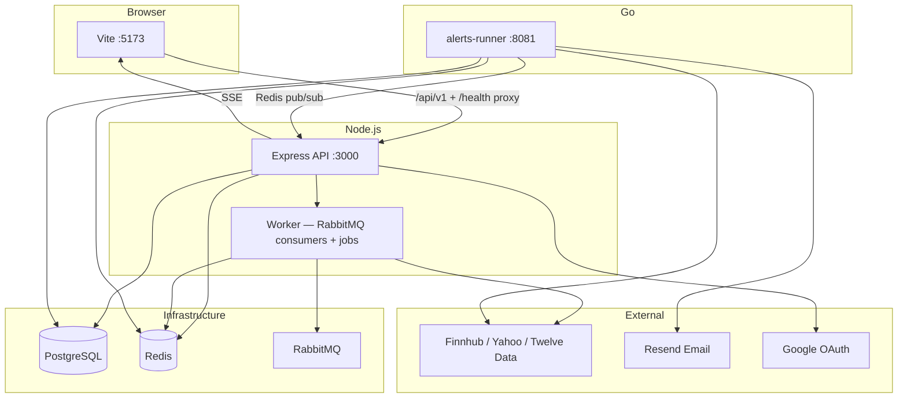

# Trading Signal

A personal trading dashboard for watchlists, market news, investment ideas (Market Ideas), and price alerts — with a React frontend and Express API.

---

## Table of contents

1. [Overview](#overview)
2. [Monorepo layout](#monorepo-layout)
3. [Architecture](#architecture)
4. [Tech stack](#tech-stack)
5. [Quick start](#quick-start)
6. [Environment variables](#environment-variables)
7. [Database](#database)
8. [API](#api)
9. [Client UI](#client-ui)
10. [Architectural decisions](#architectural-decisions)
11. [Daily development](#daily-development)
12. [Tests and CI](#tests-and-ci)
13. [Production deployment](#production-deployment)
14. [Code conventions and Cursor rules](#code-conventions-and-cursor-rules)

---

## Overview

**Trading Signal** gives signed-in users:

| Feature | Description |
|---------|-------------|
| **Market News** | Market headlines (Finnhub + background ingest) |
| **Market Ideas** | P/E and sector-based recommendations with URL-synced filters |
| **Watchlist** | Custom views, symbol search, price chart |
| **Price Alerts** | Up to 3 active alerts, email notifications, history, real-time SSE toasts |
| **Landing** | Public page with news (no login required) |

**Authentication:** email/password and Google OAuth (JWT in an httpOnly cookie).

---

## Monorepo layout

```
trading-signal/
├── client/                 # React + Vite + Tailwind
├── server/                 # Express API + Prisma + background worker
├── alerts-runner/          # Go — price alert checks + email + SSE pub/sub
├── packages/
│   └── contracts/          # Shared types and constants (client + server)
├── docker-compose.dev.yml  # Full local stack
├── docker-compose.prod.yml # Production builds
└── .cursor/rules/          # Scoped Cursor rules by package
```

**npm workspaces:** `client`, `server`, `packages/*`

```bash
npm install          # From repo root — also builds contracts (postinstall)
npm run build        # contracts → server → client
npm run test         # contracts + server (Vitest)
npm run lint         # client + server (ESLint)
```

---

## Architecture

### Service diagram (Docker dev)



### Responsibility split

| Layer | Role |
|-------|------|
| **client** | UI, React Query, routing, design system |
| **server (HTTP)** | Routes → controllers → services → repositories |
| **server (worker)** | News ingest, recommendations refresh, RabbitMQ consumers — **not** alert checking |
| **alerts-runner** | Scheduled price checks, triggers, email, Redis pub/sub for SSE |
| **packages/contracts** | Shared models, `HTTP_STATUS`, API path constants, Zod parsers |

### Price alert flow

1. User creates a `PriceAlert` (baseline price + threshold %).
2. **alerts-runner** (every ~5 min during US market hours) reads price from Redis/Finnhub.
3. On breach → row in `AlertNotification`, alert disabled (`enabled: false`).
4. Optional: branded email via Resend.
5. Redis pub/sub → server SSE → client toast + unread badge on Alerts tab.

---

## Tech stack

### Client

| Tool | Use |
|------|-----|
| React 19 | UI |
| Vite 8 | Dev server and production build |
| TypeScript 6 | Types |
| Tailwind CSS 4 | Styling + design tokens |
| TanStack React Query | Server state, cache, mutations |
| React Router 7 | Routing |
| Axios | HTTP (`withCredentials`, base URL `/api/v1`) |
| lightweight-charts | Stock chart |
| Radix UI | Dialog, Select, Dropdown |
| Lucide | Icons |
| ESLint | Recommended TS + React Hooks + import order (`eslint-plugin-perfectionist`) |

### Server

| Tool | Use |
|------|-----|
| Express 4 | HTTP API |
| Prisma 6 | ORM + migrations |
| PostgreSQL 16 | Primary database |
| Redis (ioredis) | Quote/history cache, dashboard feeds, alert pub/sub |
| RabbitMQ | `stock_ticks`, `market_news` queues |
| axios | Outbound market-data HTTP |
| bcrypt + JWT | Authentication |
| Vitest + Supertest | Tests |
| ESLint | Recommended TS, `no-console` (except `lib/logger/`) |

### Alerts runner

| Tool | Use |
|------|-----|
| Go 1.22 | Alert evaluation service |
| PostgreSQL | Same DB as the Node server |
| Redis | Quotes + pub/sub for SSE |
| Resend | Alert emails |

### Contracts (`@trading-signal/contracts`)

Shared TypeScript package consumed by client and server:

| Export | Purpose |
|--------|---------|
| `alert`, `auth`, `recommendation`, `stock`, `signal`, `news`, `watchlist` | Domain schemas and types |
| `httpStatus` | Standard HTTP status codes |
| `apiPath` | `API_VERSION`, `API_BASE_PATH`, `buildApiPath()` — single source for `/api/v1` |
| `pagination` | Paginated list response shapes |
| `zodApi` | `parseApiResponse()` and shared validation helpers |
| `parseAlertNotification` | SSE event parsing |

Pin API version in **one place** (`packages/contracts/src/apiPath.ts`); client axios and server mount both import from there.

---

## Quick start

### Requirements

- Docker + Docker Compose
- **Finnhub** API key (free tier) — [finnhub.io](https://finnhub.io)
- Optional: Google OAuth credentials, Resend (alert emails)

### Steps

```bash
git clone <repo-url> trading-signal
cd trading-signal
npm install

cp server/.env.example server/.env
# Edit server/.env — at minimum set FINNHUB_API_KEY

docker compose -f docker-compose.dev.yml up -d --build
```

### Dev URLs

| Service | URL |
|---------|-----|
| Client | http://localhost:5173 |
| API | http://localhost:3000/api/v1 |
| Health | http://localhost:3000/health |
| RabbitMQ UI | http://localhost:15672 (guest/guest) |
| alerts-runner (dev trigger) | http://localhost:8081 |

### Local development without full Docker (partial)

```bash
# Terminal 1 — infrastructure only
docker compose -f docker-compose.dev.yml up postgres redis rabbitmq -d

# Terminal 2 — API
cd server && npm run dev

# Terminal 3 — worker
cd server && npm run dev:worker

# Terminal 4 — client
cd client && npm run dev

# Terminal 5 — alerts-runner (requires Go)
cd alerts-runner && go run .
```

Vite proxies `/api` and `/health` to the server (`API_PROXY_TARGET`, default `http://localhost:3000` in Docker: `http://server:3000`).

---

## Environment variables

Full reference: `server/.env.example`

### Required for development

| Variable | Description |
|----------|-------------|
| `DATABASE_URL` | PostgreSQL connection string |
| `REDIS_URL` | Redis connection string |
| `JWT_SECRET` | JWT signing secret |
| `FINNHUB_API_KEY` | Market data (when `MARKET_DATA_PROVIDER=finnhub`) |
| `CLIENT_URL` | Client origin (CORS, emails, OAuth redirects) |

### Authentication

| Variable | Description |
|----------|-------------|
| `GOOGLE_CLIENT_ID` / `GOOGLE_CLIENT_SECRET` | Google OAuth |
| `GOOGLE_CALLBACK_URL` | Must match Google Console — e.g. `http://localhost:5173/api/v1/auth/google/callback` |
| `AUTH_ALLOW_MOCK` | `true` for dev only — fake user |

Register the **exact** callback URL in [Google Cloud Console → Credentials](https://console.cloud.google.com/apis/credentials) (including `/api/v1`).

### Market data

| Variable | Default | Description |
|----------|---------|-------------|
| `MARKET_DATA_PROVIDER` | `finnhub` | `finnhub` or `twelveData` |
| `MARKET_DATA_HISTORY_PROVIDER` | yahoo (with free Finnhub) | Chart history provider |
| `STOCK_CACHE_TTL_SECONDS` | 300 | Quote TTL in Redis |
| `STOCK_HISTORY_CACHE_TTL_SECONDS` | 3600 | History TTL in Redis |

### News and recommendations

| Variable | Description |
|----------|-------------|
| `NEWS_INGEST_*` | Worker pulls news into RabbitMQ |
| `RECOMMENDATIONS_*` | Worker computes Market Ideas |
| `DASHBOARD_NEWS_CACHE_TTL_SECONDS` | Redis TTL for news feed |
| `DASHBOARD_RECOMMENDATIONS_CACHE_TTL_SECONDS` | Redis TTL for recommendations |

### Alerts

| Variable | Description |
|----------|-------------|
| `RESEND_API_KEY` / `EMAIL_FROM` | Alert emails (Resend) |
| `ALERTS_RUNNER_URL` | e.g. `http://localhost:8081` — dev “Run check now” button |
| `ALERT_CHECK_INTERVAL_MS` | Check interval in alerts-runner (Go) |

### Production

When `NODE_ENV=production`, the server runs `validateProductionEnv` — strong JWT, no mock auth, required `DATABASE_URL`, provider keys, and related checks.

---

## Database

Prisma schema: `server/prisma/schema.prisma`

| Model | Role |
|-------|------|
| `User` | Account (email, password hash, googleId, pictureUrl) |
| `Signal` | Search/tick snapshot — price + recommendation |
| `Watchlist` / `WatchlistItem` | Custom views linked to signals |
| `PriceAlert` | Alert config (symbol, threshold, baseline) |
| `AlertNotification` | Trigger event + `readAt` |

Migrations:

```bash
cd server
npm run db:migrate:dev    # development
npm run db:migrate        # production (deploy)
```

---

## API

### Versioning and health

- All REST endpoints live under **`/api/v1`** (constant: `@trading-signal/contracts/apiPath`).
- **`GET /health`** is mounted at the app root (not under `/api/v1`) — used by Docker health checks; returns DB and Redis status.

The client axios instance uses `baseURL: '/api/v1'`. Vite/nginx proxy `/api` to the server.

### Pagination

List endpoints accept `?page=1&limit=20` (defaults from server env). Responses include pagination metadata from `@trading-signal/contracts/pagination`.

Paginated today: **price alerts**, **alert notifications**, **watchlists**.

### Auth (`/api/v1/auth`)

| Method | Path | Description |
|--------|------|-------------|
| POST | `/signup`, `/login`, `/logout` | Email/password |
| GET | `/me` | Current user (requires cookie) |
| GET | `/google`, `/google/callback` | Google OAuth |

### Dashboard

| Method | Path | Auth | Description |
|--------|------|------|-------------|
| GET | `/dashboard/news` | Optional | News feed (`?offset=&limit=`) |
| GET | `/dashboard/recommendations` | No | Market Ideas |
| GET | `/dashboard/trending` | Yes | Trending symbols |

### Stocks

| Method | Path | Description |
|--------|------|-------------|
| GET | `/stock/:symbol` | Live quote (auth) |
| GET | `/stock/:symbol/history?range=` | OHLCV for chart (auth) |
| GET | `/stocks/:symbol/search` | Search + persist Signal (auth) |

### Watchlists (`/api/v1/watchlists`)

| Method | Path | Description |
|--------|------|-------------|
| GET | `/` | List views (paginated) |
| POST | `/` | Create view |
| POST | `/:id/stocks` | Add symbol |
| DELETE | `/:id/stocks/:signalId` | Remove symbol |

### Price alerts (`/api/v1/price-alerts`)

| Method | Path | Description |
|--------|------|-------------|
| GET | `/` | List alerts (paginated) |
| POST | `/` | Create (max 3 active per user) |
| PATCH | `/:id` | Update threshold, enabled, email |
| DELETE | `/:id` | Delete |
| GET | `/notifications` | History (paginated) |
| PATCH | `/notifications/:id/read` | Mark read |
| GET | `/stream` | SSE alert events |
| POST | `/run-check` | Manual trigger (dev only) |

Domain errors map through `lib/*HttpErrors.ts`; status codes use `@trading-signal/contracts/httpStatus` — never raw numbers in new code.

---

## Client UI

### Routes

| Path | Description |
|------|-------------|
| `/` | Landing — public news |
| `/login` | Sign in |
| `/dashboard` | Market News |
| `/dashboard/recommendations` | Market Ideas (`?sector&source&action&sort`) |
| `/dashboard/alerts` | Price alerts |
| `/watchlist`, `/watchlist/:symbol` | Watchlist + chart |

### Folder structure

```
client/src/
├── api/              # Axios client, fetchValidated, queryKeys
├── components/       # Shared UI (Button, Panel, StockLogo, …)
├── features/
│   ├── alerts/
│   ├── auth/
│   ├── dashboard/    # Tabs, news, recommendations, chart
│   ├── landing/
│   ├── stocks/       # Quote, history, search hooks
│   ├── theme/
│   └── watchlists/
├── lib/              # Pure helpers
├── routes/           # AppRoutes, ProtectedRoute
└── types/            # Re-exports from contracts where needed
```

### State and data

- **React Query** — all server fetch/mutation; keys in `api/queryKeys.ts`; pass `signal` in query functions.
- **URL state** — Market Ideas filters via `useRecommendationFilters`.
- **SSE** — `useAlertEventStream` + notification invalidation.

### UI patterns

- Design tokens: `client/src/styles/tokens.css` (navy / green fintech palette).
- Dark mode: `ThemeProvider` + `localStorage`.
- Component file layout: imports → local types → helpers → main component → hooks → guards → render (see `.cursor/rules/client.mdc`).
- Sticky dashboard nav and tab toolbars (watchlist views, Market Ideas filters).

---

## Architectural decisions

### 1. Monorepo + contracts

Shared types in `packages/contracts` prevent client/server drift (alerts, HTTP status, pagination, API paths).

### 2. Separate worker and Go alert runner

- `server.ts` — HTTP API only.
- `worker.ts` — RabbitMQ, news ingest, recommendations refresh.
- **Price alert checking runs only in alerts-runner (Go)** — stable scheduling, isolated from the Express process.

### 3. Server layering

```
routes → controllers → services → repositories
```

- No Prisma in controllers.
- Request parsing in `lib/parse*.ts` helpers.
- Domain errors in services; HTTP mapping in controllers via typed error helpers.
- Auth middleware: `server/src/middleware/auth.ts`.
- Request logging: `requestContextMiddleware` adds `requestId`, logs `userId` and `durationMs` on response finish.

### 4. Redis caching

- Quotes and history: TTL + `:backup` key for resilience.
- Dashboard news and recommendations: TTL aligned with ingest intervals.
- Helper: `lib/redisJsonCache.ts`, `lib/redisBackupCache.ts`.

### 5. Market data providers

`MarketDataProvider` interface — Finnhub (quotes, news), Yahoo (free-tier history), Twelve Data (optional).

### 6. Cookie-based JWT

httpOnly cookie (not localStorage) to reduce XSS token exposure.

### 7. TypeScript discipline

- No `as` type assertions — use narrowing, parsers, or generics (`as const` allowed).
- Shared types promoted to dedicated `types.ts` files by scope (see `.cursor/rules/core.mdc`).

### 8. Product rules

- Maximum **3** active price alerts per user.
- Triggered alert → **disabled**; re-arm from alert history.

### 9. Alert emails

HTML templates live in **alerts-runner** (and a mirror in `server/src/lib/alertEmailTemplate.ts` for the Node email path). Inline “TS” monogram header — no external image URL (localhost logos break in Gmail). Sent via Resend when configured.

---

## Daily development

### Useful commands

```bash
# Logs
docker compose -f docker-compose.dev.yml logs -f server client alerts-runner

# Rebuild after Dockerfile changes
docker compose -f docker-compose.dev.yml up -d --build

# Tests
npm run test
cd alerts-runner && go test ./...

# Lint (both workspaces)
npm run lint
npm run lint -w client -- --fix
npm run lint -w server -- --fix
```

### Manual worker scripts

```bash
cd server
npm run news:ingest
npm run recommendations:refresh
```

---

## Tests and CI

GitHub Actions (`.github/workflows/ci.yml`):

1. `npm ci`
2. **Lint** — client and server (ESLint)
3. **Test** — `@trading-signal/contracts`, server (Vitest)
4. **Build** — full monorepo
5. **Go test** — `alerts-runner`

**Not in CI yet:** client unit/component tests (Vitest + RTL would be a natural addition).

Before opening a PR locally:

```bash
npm run lint
npm run test
npm run build
cd alerts-runner && go test ./...
```

---

## Production deployment

```bash
docker compose -f docker-compose.prod.yml up -d --build
```

Checklist:

- `NODE_ENV=production`
- Strong `JWT_SECRET`
- `AUTH_ALLOW_MOCK=false`
- `prisma migrate deploy` (never `db push --accept-data-loss` in production)
- Finnhub / Resend / Google credentials configured
- `CLIENT_URL` and `GOOGLE_CALLBACK_URL` point to the real domain (`…/api/v1/auth/google/callback`)
- Docker healthcheck hits `GET /health`

---

## Code conventions and Cursor rules

| File | Scope |
|------|--------|
| `.cursor/rules/core.mdc` | Always — types, no magic strings, no `as` casts |
| `.cursor/rules/client.mdc` | `client/**` — React Query, component layout, API paths |
| `.cursor/rules/server.mdc` | `server/**` — layering, logging, pagination, HTTP status |
| `.cursor/rules/alerts-runner.mdc` | `alerts-runner/**` |

Principles:

- **Minimal diffs** — change only what the task requires.
- **No magic strings** — constants, env, or contracts.
- **English comments** on functions (client + server).
- **React Query** — `signal` in queryFn; avoid `onSuccess` on mutations.
- **Logging** — use `log.info` / `log.error` from `lib/logger`; never `console.log` in app code.

---

## License

Private project (`private: true` in `package.json`).

---

## Contributing

1. Branch from `main`.
2. Follow layering and conventions above.
3. Run `npm run lint`, `npm run test`, and `npm run build` before opening a PR.
4. Update `server/.env.example` when adding environment variables.
5. Keep `@trading-signal/contracts/apiPath` as the single source for API version paths.
